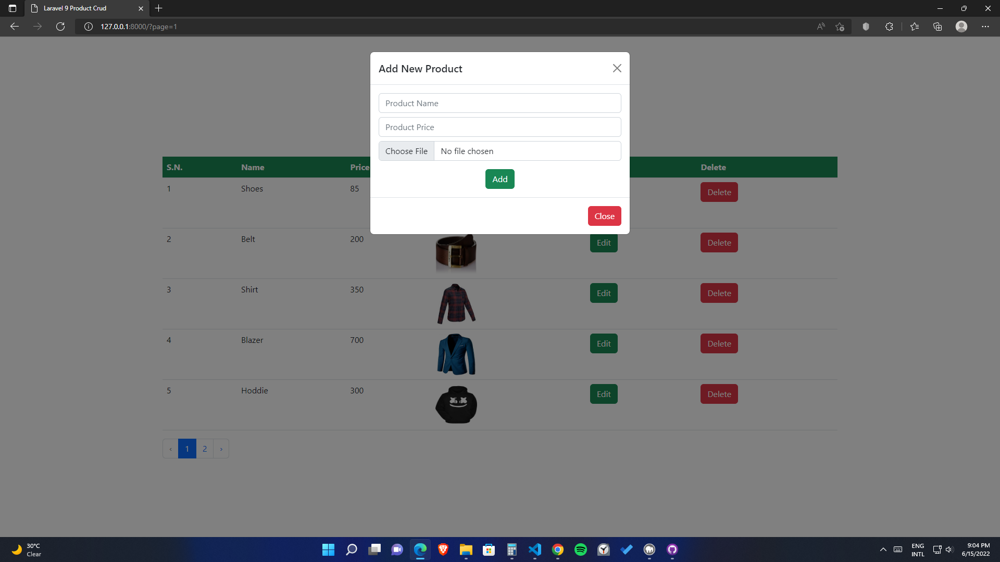

<h1>Laravel 9 Bootstrap Crud</h1>

This is a simple CRUD system using laravel 9 and bootstrap 5.2. It has also image upload facility with edit option. To run this project 
1) Create a database "laravel_crud" then import the laravel_crud.sql file.
2) download zip file or clone the project
3) rename .env.example to .env
4) open .env and update DB_DATABASE (database details)
5) run command : composer install
6) run command : php artisan key:generate
7) run command : php artisan serve

